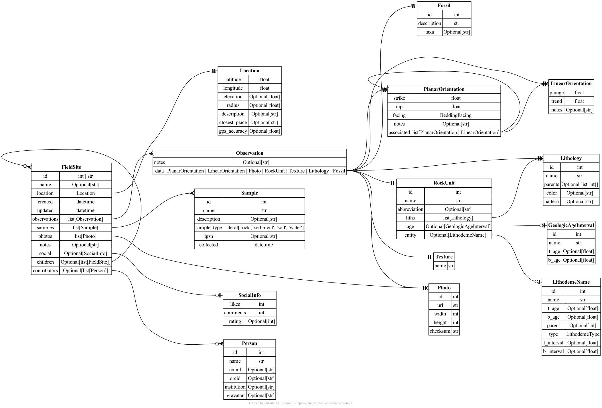

# Data interchange schemas

This repository contains the description of a data format designed for
interoperability between storage formats for geological field site
data.

## Field sites

The **Field Sites** data models support conversion between [Rockd](https://rockd.org)
"checkins" and [StraboSpot](https://strabospot.org) "spots." Both of these data
platforms represent geological field site information with photos, notes,
structural measurements and other metadata (often linked to data dictionaries).
We hope to support lossy conversion between these formats in order to allow
data to be transferred between the systems.  This will allow a "linked account" feature
whereby sites collected in one app can be transferred to the other.

# Design

By building an intermediate data
format rather than a bidirectional converter, we hope to allow new
import/export tools to be plugged into this infrastructure.
This approach is inspired by [Pandoc](https://pandoc.org/), which allows conversion between
a variety of document formats.

# Support

This project is supported by NSF [RISE-2324579](https://www.nsf.gov/awardsearch/showAward?AWD_ID=2324579),
which funds Macrostrat/StraboSpot interoperability and alignment.

# Future expansions to explore

- Conversion of Rockd "trips", or ordered field sites
- Unified KML and GeoJSON export
- [ODM2](https://github.com/ODM2/ODM2/wiki) conformance

